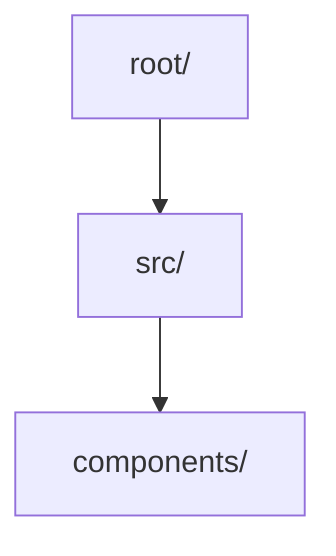
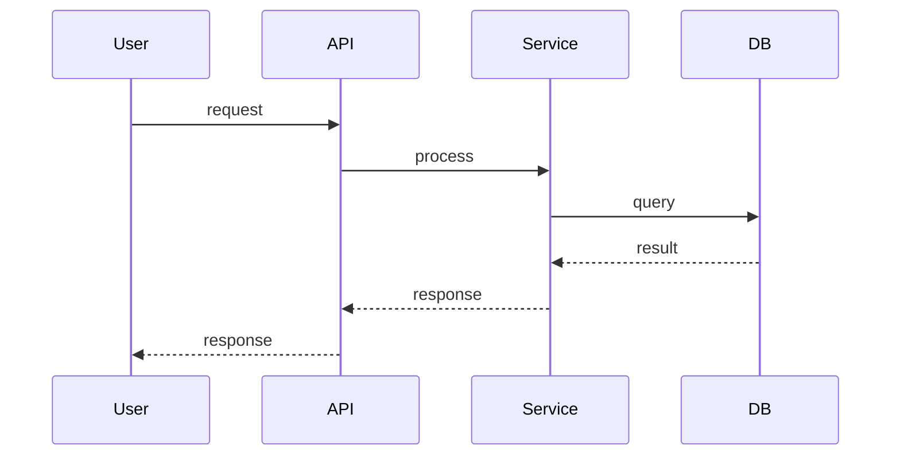

# 代码库理解

[English README](./README.md)

---

一个用于**系统化代码探索和理解**的 Claude Code 技能。

## 为什么需要这个技能？

当 AI 探索未知代码库时，经常面临以下问题：

| 问题           | 无技能时                   | 有技能时                       |
| -------------- | -------------------------- | ------------------------------ |
| **盲目阅读**   | 随机跳转到文件，无策略     | 遵循 L1→L2→L3→L4 系统方法      |
| **Token 爆炸** | 读取整个代码库，上下文溢出 | 渐进深度，每层有明确边界       |
| **无记忆**     | 学过就忘，重复工作         | 生成结构化 markdown 作为"记忆" |
| **输出混乱**   | 碎片化笔记，难以复盘       | 统一格式 + Mermaid 图表        |

## 什么是渐进式分析？

技能使用 **L1→L2→L3→L4 渐进深度**来构建理解：

```
L1: 全局扫描     → 这是什么项目？(技术栈、入口文件)
        ↓
L2: 模块划分     → 代码如何组织？(依赖关系、核心模块)
        ↓
L3: 数据流追踪   → 系统如何运行？(请求生命周期、状态)
        ↓
L4: 深度钻取     → 如何安全修改？(边界条件、风险)
```

### L1: 全局扫描

**目标**：建立整体认知

- 识别技术栈（Python? Node? Rust?）
- 定位入口文件（main.py, index.ts 等）
- 分析目录结构
- 估算代码规模

**输出**：1-2 段摘要

### L2: 模块划分

**目标**：理解系统边界

- 从入口文件追踪依赖关系
- 识别核心模块（被引用最多的）
- 分析模块职责
- 生成 Mermaid 依赖图

**输出**：模块表格 + 关系图

### L3: 数据流追踪

**目标**：理解系统运行机制

- 追踪请求生命周期
- 分析数据在各层的转换
- 梳理状态管理机制
- 生成 Mermaid 序列图

**输出**：流程图 + 说明

### L4: 深度钻取

**目标**：理解核心逻辑，为修改做准备

- 识别关键路径
- 找出边界条件（超时、重试、并发）
- 评估修改风险
- 生成决策点表格

**输出**：风险分析 + 建议

## 优势

### 1. Token 效率

| 方法                | Token 使用量 | 上下文压力 |
| ------------------- | ------------ | ---------- |
| 随机读取 100 个文件 | ~150K tokens | 溢出       |
| L1 扫描（5 个文件） | ~3K tokens   | 低         |
| L1→L2（15 个文件）  | ~10K tokens  | 中等       |
| 完整 L1→L2→L3→L4    | ~25K tokens  | 可控       |

**原因**：

- 每层有**明确的边界**
- 没有冗余的文件读取
- 每层 Token 预算：~15K

### 2. 上下文管理

技能生成**结构化输出**，作为"记忆"：

```
docs/superpowers/specs/YYYY-MM-DD-codebase-analysis.md
```

这个文件：

- 存储理解成果，供后续会话使用
- 可以直接引用，无需重新阅读
- 为修改提供审计追踪

### 3. 规模自适应

| 代码库规模      | 策略                      |
| --------------- | ------------------------- |
| 小型 (<10K 行)  | 完整 L1→L2→L3→L4          |
| 中型 (10K-100K) | L1→L2 + 针对性的 L3/L4    |
| 大型 (>100K)    | 优先 L1，然后按优先级增量 |

### 4. Mermaid 图表

生成的图表帮助可视化架构：





## 安装

```bash
# 克隆到 Claude Code skills 目录
cd ~/.claude/skills
git clone https://github.com/aidenz0/codebase-comprehension.git
```

或使用 Claude 插件：

```bash
claude plugin marketplace add https://github.com/aidenz0/codebase-comprehension
claude plugin install codebase-comprehension@codebase-comprehension --scope user
```

## 使用方法

只需告诉 Claude 分析代码库：

> "帮我理解这个项目"
> "探索这个代码库的架构"
> "找出支付流程的核心逻辑"

技能将自动应用 L1→L2→L3→L4 渐进式分析，生成综合报告。

## 输出示例

技能生成全面的 Markdown 报告，包含：

- 技术栈分析
- 模块依赖图（Mermaid）
- 数据流图（Mermaid）
- 代码统计
- 风险评估（针对修改场景）

## 对比

| 特性       | 本技能          | 传统方法       |
| ---------- | --------------- | -------------- |
| 方法       | 系统化          | 随机           |
| 深度控制   | 渐进层级        | 一次性全部     |
| 输出       | Markdown + 图表 | 笔记           |
| Token 使用 | 有界            | 无界           |
| 可复用性   | "记忆"文件      | 会话结束后丢失 |

## 工作流集成

```
brainstorming → codebase-comprehension → writing-plans
                    ↓
            生成记忆文件
                    ↓
            docs/superpowers/specs/...
```

- **brainstorming**：开始前判断项目是否需要理解
- **codebase-comprehension**：应用系统化探索
- **writing-plans**：使用生成的报告制定计划

## 为什么它有效

1. **导航类比**：像 GPS 一样，先定位当前位置（L1），再规划路线（L2-L4），而非盲目漫游

2. **Token 预算**：每层有明确范围，防止上下文溢出

3. **记忆文件**：结构化输出成为"组织知识"，供后续会话使用

4. **规模感知**：不同规模使用不同策略

## 设计哲学

借鉴 [web-access](https://github.com/eze-is/web-access)，本技能遵循以下原则：

### 技能 = 哲学 + 技术事实

技能不应是步骤手册，而应提供：

- **哲学**：底层方法和权衡
- **技术事实**：可验证的代码库事实

让 AI 基于事实做决策，不替它推理。

### 记忆优先

与 ephemeral 对话不同，本技能将输出视为"记忆"：

- 结构化 markdown 成为持久知识
- 后续会话可直接引用，无需重新探索
- 为修改提供审计追踪

### 规模感知，非一刀切

- 小型代码库：完整探索
- 大型代码库：优先级驱动，增量探索
- 每层有明确的进入/退出标准

## License

MIT

## 灵感来源

- [web-access](https://github.com/eze-is/web-access) - Claude Code 联网能力技能

---

## Star 趋势

[](https://star-history.com/#aidenz0/codebase-comprehension&Date)

---

[English Version](./README.md)
