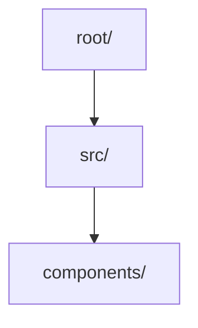
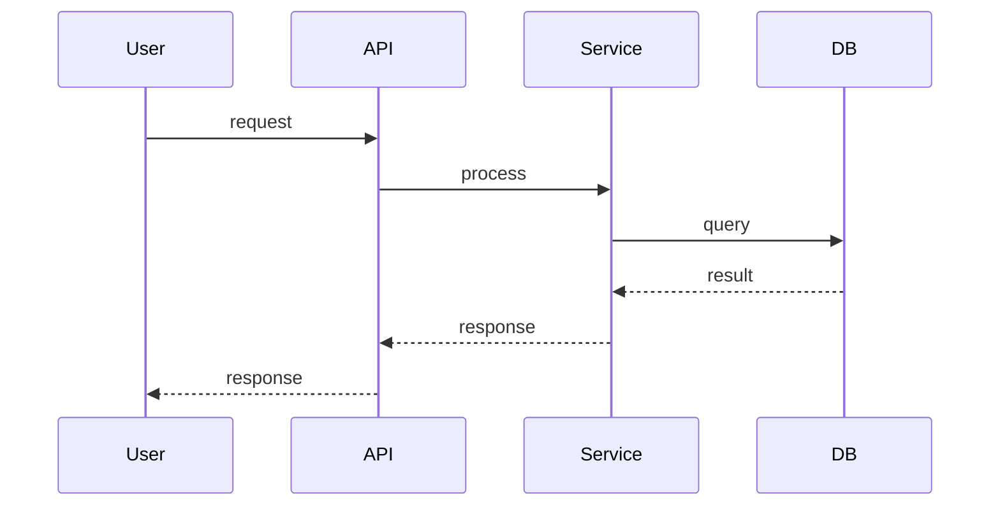

# Codebase Comprehension

[中文 README](./README-cn.md)

---

A Claude Code skill for **systematic code exploration and understanding**.

## Why This Skill?

When AI explores unknown codebases, it often faces these problems:

| Problem | Without Skill | With Skill |
|---------|---------------|-------------|
| **Random reading** | Jumps between files randomly, no strategy | Follows L1→L2→L3→L4 systematic approach |
| **Token explosion** | Reads entire codebase, context overflow | Progressive depth, each level has clear boundaries |
| **No memory** | Forgets what was learned, repeats work | Generates structured markdown as "memory" |
| **Poor output** | Fragmented notes, hard to review | Unified format with Mermaid diagrams |

## What is Progressive Analysis?

The skill uses **L1→L2→L3→L4 progressive depth** to build understanding:

```
L1: Global Scan     → What is this project? (tech stack, entry points)
        ↓
L2: Module Partition → How is it organized? (dependencies, core modules)
        ↓
L3: Data Flow      → How does it work? (request lifecycle, state)
        ↓
L4: Deep Dive      → How to modify safely? (boundary conditions, risks)
```

### L1: Global Scan (5 min)

**Goal**: Build overall understanding

- Identify tech stack (Python? Node? Rust?)
- Locate entry files (main.py, index.ts, etc.)
- Analyze directory structure
- Estimate code scale

**Output**: 1-2 paragraphs summary

### L2: Module Partition (10 min)

**Goal**: Understand system boundaries

- Trace dependencies from entry points
- Identify core modules (most referenced)
- Analyze module responsibilities
- Generate Mermaid dependency graph

**Output**: Module table + diagram

### L3: Data Flow Tracing (15 min)

**Goal**: Understand how the system works

- Trace request lifecycle
- Analyze data transformation
- Map state management
- Generate Mermaid sequence diagram

**Output**: Flow diagram + description

### L4: Deep Dive (20 min)

**Goal**: Understand core logic for modifications

- Identify critical paths
- Find boundary conditions (timeout, retry, concurrency)
- Assess modification risks
- Generate decision point tables

**Output**: Risk analysis + recommendations

## Advantages

### 1. Token Efficiency

| Approach | Token Usage | Context Pressure |
|----------|-------------|------------------|
| Random reading 100 files | ~150K tokens | Overflow |
| L1 scan (5 files) | ~3K tokens | Low |
| L1→L2 (15 files) | ~10K tokens | Medium |
| Full L1→L2→L3→L4 | ~25K tokens | Controlled |

**Why?**
- Each level has **clear boundaries**
- No redundant file reads
- Token budget per level: ~15K

### 2. Context Management

The skill generates **structured output** that serves as "memory":

```
docs/superpowers/specs/YYYY-MM-DD-codebase-analysis.md
```

This file:
- Stores understanding for future sessions
- Can be referenced instead of re-reading
- Provides audit trail for modifications

### 3. Scale Adaptation

| Codebase Size | Strategy |
|--------------|----------|
| Small (<10K lines) | Full L1→L2→L3→L4 |
| Medium (10K-100K) | L1→L2 + targeted L3/L4 |
| Large (>100K) | L1 first, then priority-driven |

### 4. Mermaid Diagrams

Generated diagrams help visualize architecture:





## Installation

```bash
# Clone to Claude Code skills directory
cd ~/.claude/skills
git clone https://github.com/aidenz0/codebase-comprehension.git
```

Or use Claude Plugin:

```bash
claude plugin marketplace add https://github.com/aidenz0/codebase-comprehension
claude plugin install codebase-comprehension@codebase-comprehension --scope user
```

## Usage

Simply tell Claude to analyze a codebase:

> "Help me understand this project"
> "Explore the architecture of this codebase"
> "Find the core logic for payment processing"

The skill will automatically apply L1→L2→L3→L4 progressive analysis and generate a comprehensive report.

## Output Example

See [MiniMind Analysis](./test-projects/minimind-analysis.md) for a complete example.

## Comparison

| Feature | This Skill | Traditional Approach |
|---------|------------|---------------------|
| Method | Systematic | Random |
| Depth Control | Progressive levels | All at once |
| Output | Markdown + Diagrams | Notes |
| Token Usage | Bounded | Unbounded |
| Reusability | "Memory" file | Lost after session |

## Workflow Integration

```
brainstorming → codebase-comprehension → writing-plans
                    ↓
            Generate memory file
                    ↓
            docs/superpowers/specs/...
```

- **brainstorming**: Before starting, check if project needs understanding
- **codebase-comprehension**: Apply systematic exploration
- **writing-plans**: Use generated report for planning

## Why It Works

1. **Navigation analogy**: Like a GPS, you first locate where you are (L1), then plan route (L2-L4), not wander randomly

2. **Token budget**: Each level has clear scope, preventing context overflow

3. **Memory file**: Structured output becomes "institutional knowledge" for future sessions

4. **Scale-aware**: Different strategies for different codebase sizes

## License

MIT

## Inspired By

- [web-access](https://github.com/eze-is/web-access) - Claude Code web access skill
- [Superpowers](https://github.com/superpowers) - Skills framework
- [Claude Code](https://claude.com/claude-code) - AI coding assistant

---

[中文版本](./README-cn.md)