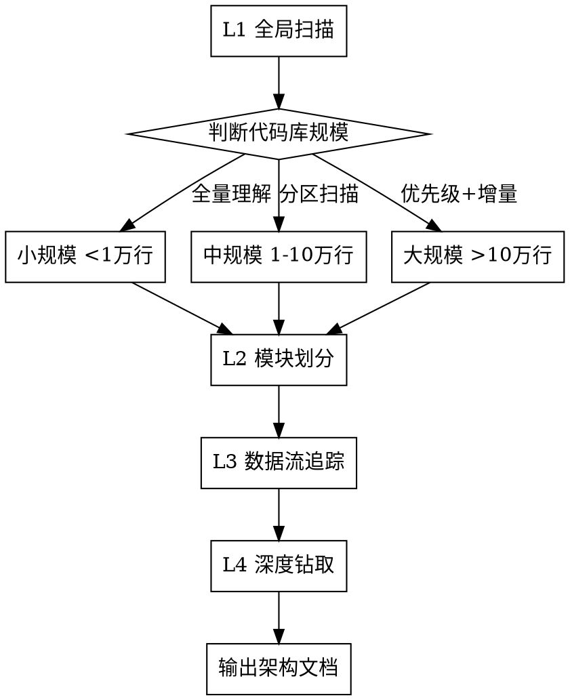
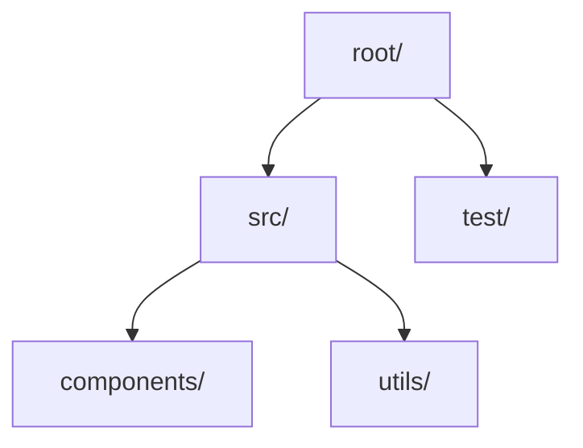
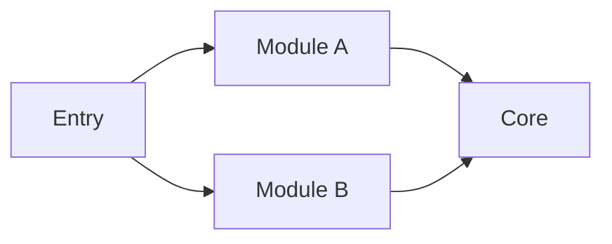
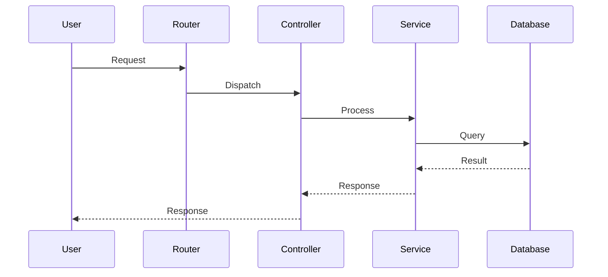
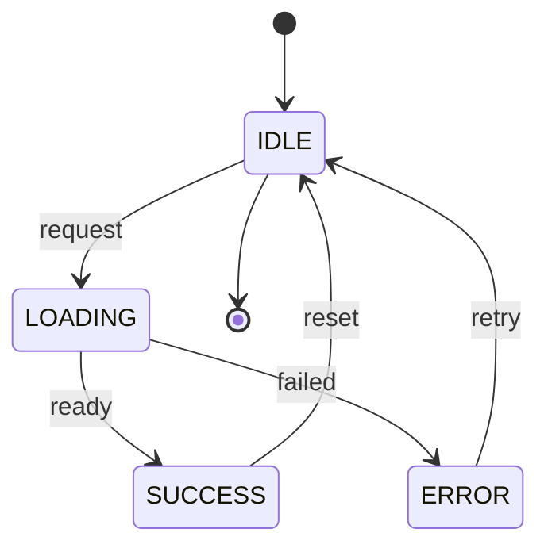
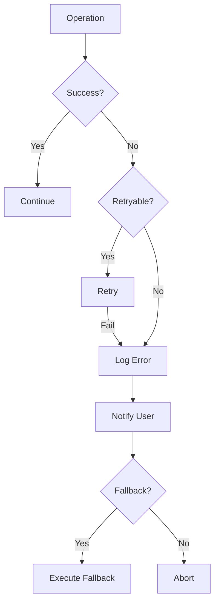
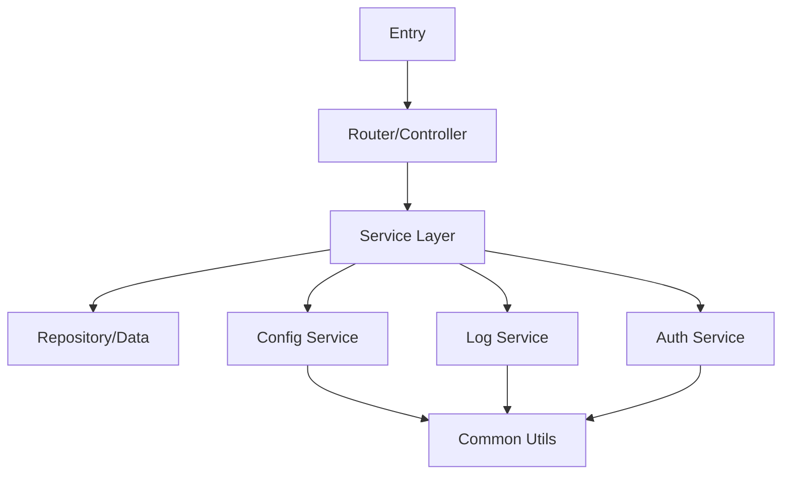
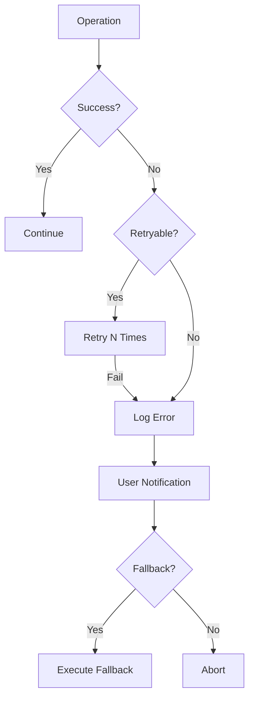
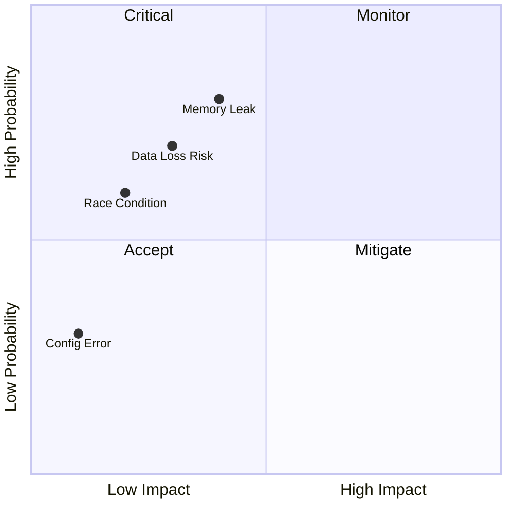

# Codebase Comprehension

## Overview

Systematic approach to understand any codebase regardless of scale. Use L1→L2→L3→L4 progressive depth to build complete mental model efficiently.

## When to Use

- Onboarding to a new project
- Understanding large-scale architecture
- Finding specific functionality in big codebases
- Analyzing critical paths for modifications
- Any scenario requiring "how does this work?"

## Core Philosophy

**Skill = 渐进式理解策略 + 技术事实**

像导航仪一样工作：先定位当前位置(L1)，再规划路线(L2-L4)，而不是漫无目的乱逛。

## Process Flow



## L1: Global Scan

**Goal: Build overall认知**

### Step 1: Identify Tech Stack

Check these files to determine technology:

| File | Indicates |
|------|-----------|
| `package.json` | Node.js/npm ecosystem |
| `Cargo.toml` | Rust |
| `pom.xml` / `build.gradle` | Java/JVM |
| `go.mod` | Go |
| `requirements.txt` / `Pipfile` | Python |
| `*.csproj` | C#/.NET |
| `composer.json` | PHP |
| `Gemfile` | Ruby |

### Step 2: Identify Entry Points

Priority order:
1. `main.*` / `index.*` - Entry points
2. `app.*` / `application.*` - Application entry
3. `server.*` / `serve.*` - Server entry
4. `*config*` - Configuration entry
5. `routing` / `routes` / `router` - Route entry

### Step 3: Directory Structure Analysis

Common patterns:

```
src/          → Source code
cmd/          → Command entry (Go)
lib/          → Library code
internal/     → Private code
pkg/          → Public packages
api/          → API definitions
docs/         → Documentation
test/         → Tests
```

### Step 4: Code Scale Estimation

Count lines and files:
```bash
find . -name "*.ts" -o -name "*.js" -o -name "*.py" | wc -l
```

**Output L1:**
- Technology stack list
- Entry files
- Directory tree
- Scale estimation (lines/files)

## L2: Module Partition

**Goal: Understand system boundaries**

### Step 1: Trace Dependencies

From entry point, trace `import`/`require` statements:

```javascript
// Dependency analysis strategy
1. Find entry file
2. Trace first-level imports
3. Aggregate by module level
4. Identify core modules (most referenced)
5. Identify edge modules (least dependencies)
```

### Step 2: Identify Module Responsibilities

From filenames and directories, infer:
- What each module does
- What it depends on
- What depends on it

### Step 3: Identify Key Interfaces

For each core module, find:
- Public functions/classes
- Data structures
- Event/API boundaries

**Output L2:**
- Core module table with responsibilities
- Mermaid dependency graph
- Key interfaces list

## L3: Data Flow Tracing

**Goal: Understand how the system works**

### Step 1: Request Lifecycle

For web applications:
1. HTTP request → Router → Controller → Service → Repository → Database
2. Identify all middleware/interceptors in the chain

For CLI applications:
1. CLI argument parsing → Command handler → Business logic → Output

### Step 2: Data Transformation

- How data enters the system
- How it's transformed at each layer
- How it's stored/persisted

### Step 3: State Management

- Where is state held?
- How is state updated?
- What's the lifecycle?

**Output L3:**
- Mermaid sequence diagram
- Data flow description
- State management overview

## L4: Deep Dive

**Goal: Understand core logic**

### Step 1: Identify Critical Paths

Based on the feature you're analyzing:
- What's the happy path?
- What are the error paths?
- What are the edge cases?

### Step 2: Boundary Conditions

Find:
- Timeout configurations
- Retry mechanisms
- Error handling
- Concurrency control
- Race conditions

### Step 3: Risk Assessment

For modification scenarios:
- What could break?
- What's the blast radius?
- What's already tested?

**Output L4:**
- Core logic description
- Decision points list
- Risk annotations

## Scale-Based Strategy

### Small Codebase (<10K lines)

**Strategy: Full scan + focused reading**

1. List all files
2. Read key entry files
3. Map module relationships
4. Generate architecture summary

### Medium Codebase (10K-100K lines)

**Strategy: Partitioned scan + correlation analysis**

1. Partition by directory
2. Pick key files per partition
3. Establish cross-partition dependencies
4. Focus on core modules

### Large Codebase (>100K lines)

**Strategy: Priority-driven + incremental**

1. Define understanding goal
2. Pick exploration path by priority
3. Limit each round to ~15K tokens
4. Accumulate understanding progressively

**Token Budget:**
- Each exploration round ≤15K tokens
- Use "snapshot + increment" mode
- Prioritize highly-referenced core modules

## Output Format

### Markdown Architecture Document

Save to `docs/superpowers/specs/YYYY-MM-DD-codebase-analysis.md`:

```markdown
# Codebase Analysis Report

## Tech Stack
- Language/Framework: ...
- Build Tools: ...
- Dependency Management: ...

## System Architecture
- Module Division: ...
- Core Entry Points: ...
- Data Flow: ...

## Core Modules
| Module | Responsibility | Key Interfaces |
|--------|---------------|----------------|
| ...    | ...           | ...            |

## Data Flow
- Request Lifecycle: ...
- State Management: ...

## Critical Paths (if applicable)
- Happy Path: ...
- Error Paths: ...
- Edge Cases: ...

## Risk Points (if modification planned)
- Risks: ...
- Recommendations: ...

## Mermaid Diagrams
[Include diagrams here - see below]
```

### Mermaid Diagrams (Required)

**CRITICAL**: Use these syntax rules for maximum compatibility:

1. **Use English labels** in all diagrams
2. **Wrap Chinese text in double quotes**: `"中文标签"`
3. **Avoid special characters** in node labels: `[]{}|`/
4. **Avoid subgraph** - not supported in many renderers
5. **Use `participant`** in sequence diagrams

#### Include these diagrams:

- **Directory Tree** (L1): graph TD
- **Module Dependency** (L2): graph LR  
- **Data Flow** (L3): sequenceDiagram with `participant`
- **State Machine** (L3): stateDiagram-v2
- **Error Handling** (L4): flowchart TD

1. **Directory Tree** (for L1)


2. **Module Dependency** (for L2)


3. **Data Flow** (for L3)


4. **State Machine** (for L3 state management)


5. **Error Handling Flow** (for L4)


## Common Mistakes

| Mistake | Correction |
|---------|------------|
| Random file reading | Follow L1→L2→L3→L4 order |
| Grep keyword only | Use dependency analysis |
| Skip tech stack identification | Always start with L1 |
| No structured output | Generate markdown + mermaid |
| No scale-based strategy | Adjust depth by code size |
| Ignore boundary conditions | Always check L4 for modifications |
| Mermaid not rendering | Use English labels, double quotes for Chinese, avoid subgraph |

## Quick Reference

| Task | Start With |
|------|------------|
| Quick overview | L1 only |
| Find specific module | L1 → L2 |
| Understand feature | L1 → L2 → L3 |
| Plan modification | L1 → L2 → L3 → L4 |

## Mermaid Templates

### Complete Architecture Diagram (L2)



### State Machine (L3)


### Error Handling Flow (L4)



### Risk Assessment Matrix (L4)



## Implementation Example

### Prompt Template for L1 Scan

```
Execute L1 Global Scan:
1. Scan root directory, identify tech stack (check package.json, Cargo.toml, etc.)
2. List directory structure
3. Find entry files (main.*, index.*, app.*)
4. Estimate code scale

Output: tech stack list, entry files, directory tree (mermaid), code lines
```

### Prompt Template for L2 Module Analysis

```
Execute L2 Module Analysis:
1. Trace import/require from entry files
2. Count module references, find core modules
3. Analyze each core module's responsibility
4. Draw Mermaid dependency graph

Output: core module table, Mermaid dependency graph
- Use English labels: A["module_name"]
- Use double quotes for Chinese: "模块名"
```

### Prompt Template for L3 Data Flow

```
Execute L3 Data Flow Tracing:
1. Trace complete request lifecycle of [feature name]
2. List data transformation at each layer
3. Identify state management mechanism
4. Draw Mermaid sequence diagram

Output: lifecycle description, data transformation table, Mermaid sequence diagram
- Use: participant User instead of "User as 用户"
- Use English in loop/Note: loop instead of "循环"
```

### Prompt Template for L4 Deep Dive

```
Execute L4 Deep Dive:
1. Find all boundary conditions (timeout, retry, concurrency, cancel)
2. List error handling paths
3. Mark potential risk points (high/medium/low)
4. Propose modification suggestions

Output: boundary condition table, risk list, modification suggestions
```